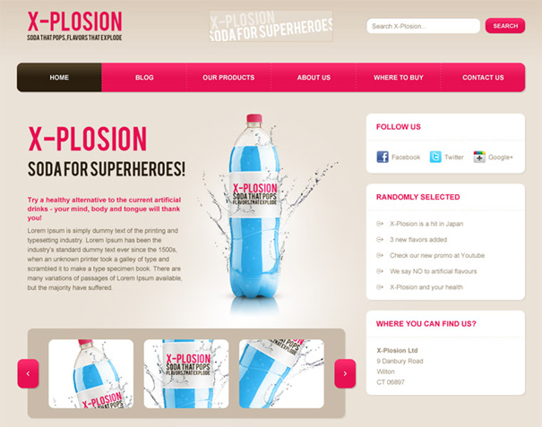

Front-end Test Project
======================

## Project brief
Convert the following parts of X-Plosion web site to HTML/CSS/JS. **Do not code the whole website, only the following 2 parts from the home page!**

- 3 blocks in the sidebar - http://screencast.com/t/VDe4tkzo7E8H
- News area - http://screencast.com/t/B31RvB5ZyFsQ

## Requirements
1. Create project using **XH Generator** - https://github.com/xhtmlized/generator-xh
2. Use HTML5 / SCSS
3. Create page called Home and place the elements on it
4. Use CSS3 PIE to add CSS3 support to IE8
5. Add Colorbox (http://www.jacklmoore.com/colorbox/) as a Bower dependency and open sample photos in the news section as an image group / gallery like follows:
  * When the page loads open the first photo in colorbox automatically (without user clicking on the image).
  * Go through all 4 images in 2 seconds interval but without using a built in slideshow functionality (Hint: Check *Event Hooks* example on the Colorbox homepage.)
  * Close Colorbox when the last image from the gallery is reached.
    
## Download PSD
[xplosion.zip](xplosion.zip) (2.1MB)

## Supported browsers
Ensure that the elements work and display correctly in the following browsers:

- Firefox (latest version)
- Google Chrome (latest version)
- Internet Explorer 11
- Internet Explorer 8

## Coding Standards
When working on the project follow our coding standards:

- [HTML Coding Standards](https://github.com/xhtmlized/html-coding-standards)
- [CSS Coding Standards](https://github.com/xhtmlized/css-coding-standards)
- [JavaScript Coding Standards](https://github.com/xhtmlized/js-coding-standards)

Ensure that your editor can load settings from .editorconfig file, otherwise use the same coding style as specified in it.

## Project Delivery
Create a public repo on your Github account and share the project URL with us once it’s done.

