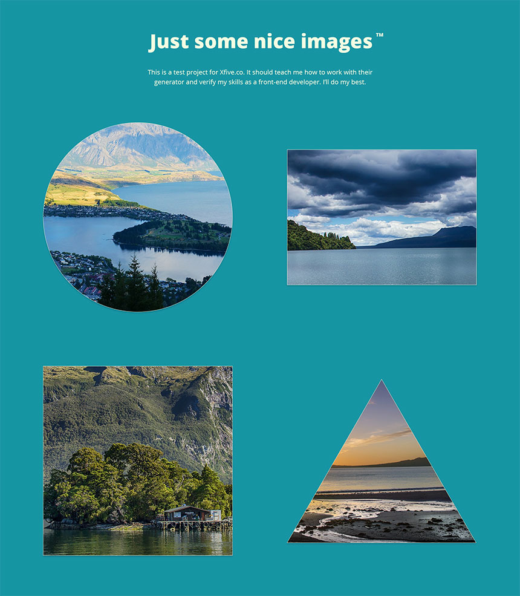

Front-end Test Project
======================

## Project brief
Convert the following designs to HTML/CSS/JS.

### Thumbnails

### Overlay

## Requirements
1. Create project using [Chisel](https://www.getchisel.co/)
2. Use HTML5 / SCSS
3. Make it responsive using your best judgement.
4. Create a simple custom overlay for photos - use only vanilla JavaScript, do not use jQuery or any other external libraries for it.
5. Create some hover effect for the image thumbnails.
6. Make the page the smallest possible size - ensure that images are properly optimized, resources minified, etc.
7. *Optional bonus task 1:* Make images responsive
8. *Optional bonus task 2:* Add basic routing – make browser's back button work properly; open overlay based on URL.

## Design
Design is available in [Figma](https://www.figma.com/) at https://www.figma.com/file/ZGj2jrg8V5tE2g35V8ueAHAb/Xfive-Front-end-Test. If you haven't already, sign up for a free Figma account, so you can work with the design.

The following images are used in the design:
 -  https://pixabay.com/en/new-zealand-lake-mountain-landscape-679068/
 -  https://pixabay.com/en/new-zealand-lake-web-kai-dock-583176/
 -  https://pixabay.com/en/new-zealand-doubtful-sound-fjord-583181/
 -  https://pixabay.com/en/sun-rise-beach-new-zealand-auckland-661541/

## Supported browsers
Ensure that the elements work and display correctly in the following browsers:

- Firefox (latest version)
- Google Chrome (latest version)
- Microsoft Edge
- Internet Explorer 11

## Coding Standards
When working on the project use consistent coding style. Try to follow what's already in Chisel - EditorConfig, stylelint, ESLint (see [Code Quality](https://www.getchisel.co/docs/development/code-quality/)), [ITCSS](https://www.getchisel.co/docs/development/itcss/), etc.

## Project Deadline
Take your time but try to deliver it within 2 weeks time. If we don't see any activity in your test repository after 2 weeks (at least initial commits), we will automatically withdraw your application.

## Quality Assurance

What you need to do to get high QA score? Simply answer **Yes** to all these questions:

### General

- Are all requirements set above met?
- Can the project be built using `npm run build`?
- Is the page working without any JS errors?

### Precision

- Is reasonable precision achieved?

### Browser check

- Does page display and work correctly in supported browsers?

### Valid HTML

- Is the page valid?

### Semantic Markup

- Are the correct tags being used?

### Coding Standards

- Is the page using a consistent HTML coding style?
- Is the page using a consistent CSS coding style?
- Is the page using a consistent JS coding style?

### Optimization

- Are image files sufficiently compressed?
- Is CSS and JS concatenated and minified?

### Accessibility

- Are proper ALT attributes for images provided?
- Are ARIA attributes properly used?
- Is proper heading structure in place?
